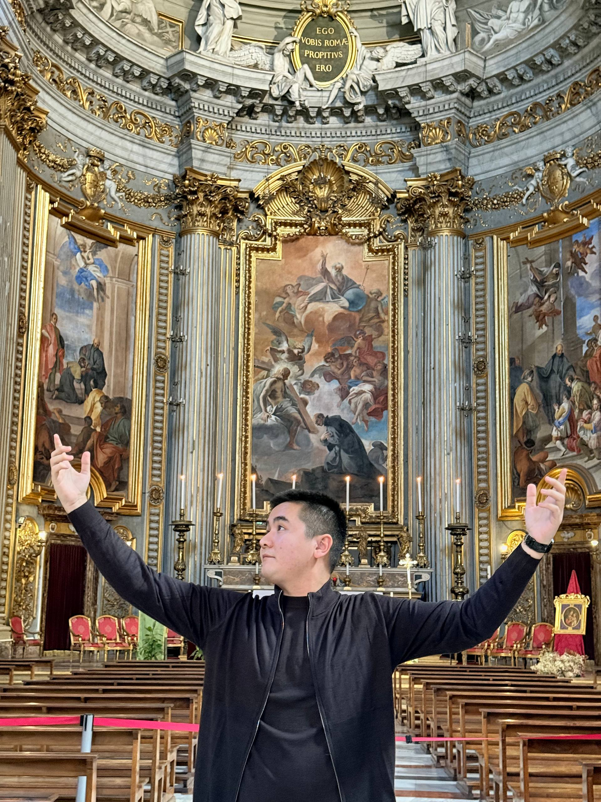

# Muwsa Seytniyazov

******

## Junior Developer

******

### Contact Information:

**Phone:** +393513071426 
**Discord:** @muwsa8484 
**GitHub:** @muwsasejtniyazov 
**Instagramm:** @musasejtniyazov 
**Telegramm:** @sejtniyazov 

******

### Information About Myself:

My name is Muwsa, born in Nukus, Uzbekistan.  
Currently I'm studiyng and living in Rome, Italy 
1st grade student in university Tor Vergata 
Main Course totally taught in english in Engineering Sciences 

******

### Skills:

- HTML5
- CSS3
- JavaScript *basic*
- Python *basic*

### Code Sample: 

function multiply(a, b){ 
  a * b 
} 

******

### Job occupancy:

Unemployed, only worked as a runner and waiter on a part-time deal. 

******

### Education:

Graduated 11 years of school in Nukus,  
Then finished the Foundation Course at university of Tor Vergata 

### Languages:

- Qaraqalpaq \- Native
- Uzbekish \- Native
- Russian \- Adcanced
- English \- IELTS 6.5
- Italian \- Elementary

